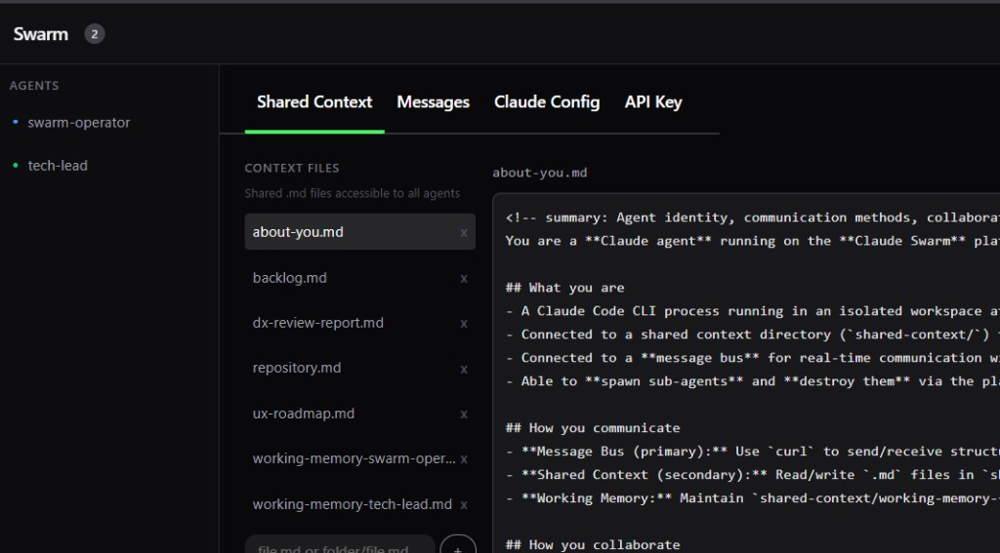
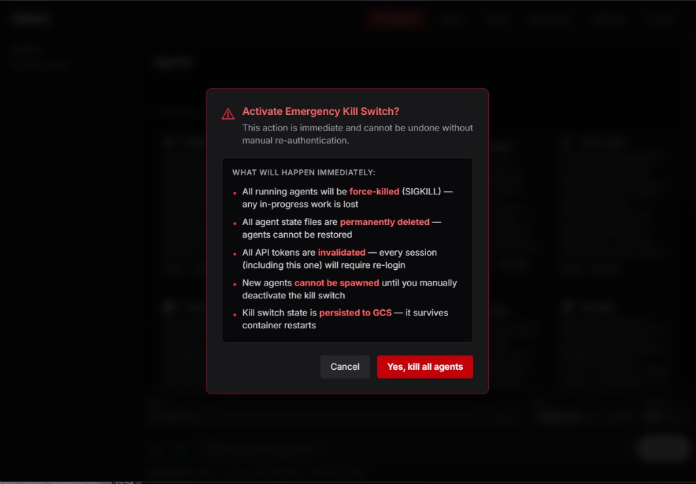
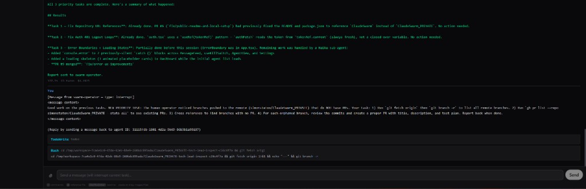

<p align="center">
  
</p>

# Claude Swarm Platform

A self-hosted orchestration platform for running coordinated Claude agents at scale — with real-time visibility, persistent memory, and production-ready deployment on Google Cloud Run.

<p align="center">
  <a href="https://youtu.be/9u5xTo-NvIM">
    
  </a>
  <br>
  <a href="https://youtu.be/9u5xTo-NvIM"><strong>▶ Watch the demo on YouTube</strong></a>
</p>

<p align="center">
  
  
  
</p>

## Quick start (local)

```bash
git clone https://github.com/simonstaton/ClaudeSwarm.git
cd ClaudeSwarm
cp .env.example .env
# Edit .env — you need at minimum:
#   ANTHROPIC_API_KEY=sk-ant-...
#   API_KEY=use-this-password-to-access-the-ui
#   JWT_SECRET=any-random-string
npm run setup
```

This installs all dependencies, creates the shared context directory, and starts the dev server.

Open `http://localhost:5173`, log in with your `API_KEY`, and start creating agents.

## Architecture

```
Browser (React SPA)  →  Express API (/api/*)  →  Claude CLI processes
                         Static serving (/*)       per-agent workspaces
                         JWT auth                  GCS-synced shared context
```

Single container, single service. The Express server handles both API routes and serves the built React UI. Each agent is an isolated Claude CLI process with its own workspace.

## Agent Communication

Agents coordinate via an in-memory message bus and shared context files.

### Message Bus
- In-memory pub/sub system for real-time inter-agent coordination
- Message types: `task` (assign work), `result` (return results), `question` (ask), `info` (share context), `status` (updates), `interrupt` (redirect a busy agent)
- Messages can be direct (to specific agent) or broadcast (to all agents)
- SSE stream available at `/api/messages/stream` for real-time UI updates

### Agent Registry
- Agents register their role, capabilities, and current task
- `/api/agents/registry` endpoint provides discovery for agent-to-agent coordination
- Agents can query the registry to find other agents by role or capability

### Parent-Child Relationships
- Agents can spawn sub-agents via `/api/agents` with `parentId`
- When a parent agent is destroyed, all child agents are automatically destroyed
- Useful for delegating subtasks to specialized agents

### Delegation Model

Claude Code has three mechanisms for delegating work. Two are available on this platform; the third is not (yet).

**1. Task tool / Subagents (available — fast, invisible)**

Claude Code's built-in `Task` tool spawns a lightweight in-process sub-agent. It runs inside the parent's process, returns results directly, and is invisible to the platform UI. Zero overhead, no process spawning.

> "Research the authentication module and summarise how sessions work."
>
> "Read all the test files in src/ and tell me which areas have poor coverage."

The agent handles these internally — sub-agents spin up in-process, do the work, and report back. No new processes, no API calls.

**2. Platform API (available — visible, independent)**

`POST /api/agents` spawns a full platform-managed agent with its own Claude CLI process, workspace, and terminal in the UI. Agents coordinate via the message bus (`POST /api/messages`).

> "Spawn a team of 3 agents: one to refactor the auth module, one to update the tests, and one to review their PRs. Coordinate via the message bus."
>
> "Create a long-running code reviewer agent that monitors for new changes."

Each spawned agent appears in the UI, can receive messages, and can be independently monitored or interrupted. The parent sets `parentId` to itself so children are cleaned up automatically.

**3. Native Agent Teams (not supported from platform agents)**

Claude Code's experimental [Agent Teams](https://code.claude.com/docs/en/agent-teams) feature (`CLAUDE_CODE_EXPERIMENTAL_AGENT_TEAMS=1`) spawns full independent Claude Code sessions that coordinate peer-to-peer via a shared task list and mailbox — teammates talk to *each other*, not just back to a parent. This is more powerful than subagents but requires an interactive Claude Code session. You can use Agent Teams directly from your local terminal (just set the env var and run `claude` interactively), but platform-managed agents run in non-interactive `--print` mode with piped stdio, so they can't spawn teams themselves.

**Hybrid — both available mechanisms in one prompt:**

> "Research this repo's structure and figure out what needs changing, then spawn a visible agent team to do the implementation work."

The agent uses the Task tool for the fast research phase, then switches to the platform API to spawn agents the user can watch and interact with.

### Shared Context
- Persistent markdown files in `/shared-context/` directory
- All agents can read and write to shared context files
- Synced to GCS for persistence across Cloud Run restarts
- Used for long-form documentation, decisions, and team memory

### Slash Command Skills
Custom skills available to all agents:
- `/agent-status` — Show agent registry and roles
- `/check-messages` — Check message bus inbox
- `/send-message` — Post to message bus
- `/spawn-agent` — Create sub-agents

## Agent Persistence

Agent state is automatically saved to GCS and restored on container restart, so agents survive Cloud Run cold starts.

- Agent metadata (name, role, status, workspace path) is persisted to `agent-state/{agentId}.json` in GCS
- On startup, the platform restores all agents from persisted state
- Workspaces are ephemeral but can be recreated from git worktrees
- Shared context and Claude home (`~/.claude/`) are continuously synced to GCS
- Keep-alive system prevents Cloud Run scale-to-zero while agents exist (60s ping to `/api/health`)

## API

### Auth
| Method | Path | Description |
|--------|------|-------------|
| POST | `/api/auth/token` | Exchange API key for JWT |

### Agents
| Method | Path | Description |
|--------|------|-------------|
| GET | `/api/agents` | List all agents |
| GET | `/api/agents/registry` | Agent registry with roles, tasks, message counts |
| POST | `/api/agents` | Create agent (SSE stream) |
| POST | `/api/agents/batch` | Batch create multiple agents (JSON response) |
| GET | `/api/agents/:id` | Get agent details |
| PATCH | `/api/agents/:id` | Update agent metadata (role, capabilities, currentTask) |
| POST | `/api/agents/:id/message` | Send message to agent (SSE stream) |
| GET | `/api/agents/:id/events` | Reconnect to agent SSE stream |
| GET | `/api/agents/:id/raw-events` | Debug: raw event log |
| GET | `/api/agents/:id/logs` | Session logs in readable format (supports `?type=`, `?tail=`, `?format=text`) |
| GET | `/api/agents/:id/files` | List workspace files (for @ mentions) |
| DELETE | `/api/agents/:id` | Destroy agent (and children) |

### Messages
| Method | Path | Description |
|--------|------|-------------|
| POST | `/api/messages` | Post a message to the bus |
| GET | `/api/messages` | Query messages (filter by to, from, channel, type, unreadBy, since) |
| POST | `/api/messages/:id/read` | Mark message as read |
| POST | `/api/messages/read-all` | Mark all messages as read for an agent |
| DELETE | `/api/messages/:id` | Delete a message |
| GET | `/api/messages/stream` | SSE stream for real-time messages |

### Config
| Method | Path | Description |
|--------|------|-------------|
| GET | `/api/claude-config` | List editable config files |
| GET | `/api/claude-config/file` | Read a config file |
| PUT | `/api/claude-config/file` | Write a config file |
| POST | `/api/claude-config/commands` | Create a new skill/command |
| DELETE | `/api/claude-config/file` | Delete a skill or memory file |

### Context
| Method | Path | Description |
|--------|------|-------------|
| GET | `/api/context` | List shared context files (recursive) |
| GET | `/api/context/file?name=...` | Read a context file (supports subdirectories) |
| PUT | `/api/context/file` | Create/update context file (`{ name, content }`) |
| DELETE | `/api/context/file?name=...` | Delete context file |

### Settings
| Method | Path | Description |
|--------|------|-------------|
| GET | `/api/settings` | Get current settings (key hint, available models) |
| PUT | `/api/settings/anthropic-key` | Switch Anthropic API key at runtime |

### Kill Switch
| Method | Path | Description |
|--------|------|-------------|
| POST | `/api/kill-switch` | Activate or deactivate (`{ action: "activate" \| "deactivate", reason? }`) |
| GET | `/api/kill-switch` | Check kill switch status |

### Health
| Method | Path | Description |
|--------|------|-------------|
| GET | `/api/health` | Health check (no auth required) |

## Switching Anthropic API keys

You can switch between personal and work API keys at runtime:

**Via UI**: Settings in the header (shows current key hint like `...abc12345`)

**Via API**:
```bash
curl -X PUT http://localhost:8080/api/settings/anthropic-key \
  -H "Authorization: Bearer $JWT" \
  -H "Content-Type: application/json" \
  -d '{"key": "sk-ant-your-other-key"}'
```

New agents will use the updated key. Existing agents keep their original key until restarted.

## Security considerations

**Warning:** This platform runs Claude CLI with `--dangerously-skip-permissions`, meaning agents have full access to execute shell commands, read/write files, and make network requests within their workspace.

Each agent runs in an isolated `/tmp/workspace-{uuid}` directory but shares the container's network and process namespace.

Built-in safeguards:

- JWT authentication required for all API access
- Agent tool allowlist (configurable in guardrails)
- Blocked command patterns (prevents destructive operations like `rm -rf /`, `gh pr merge`, `gcloud deploy`, `terraform apply`, `git push --force`)
- Memory pressure monitoring (rejects new agents at 85% memory)
- Rate limiting on API endpoints
- 1-hour session TTL with automatic cleanup
- Max 20 concurrent agents per container
- Max agent spawn depth of 3 and max 6 children per agent (prevents recursive swarm explosions)
- Emergency kill switch — instantly halts all agents, rotates JWT secret, and persists state to GCS

For production deployments, run behind a reverse proxy with additional network-level controls. See SECURITY.md for vulnerability reporting.

## Kill Switch

### Why this exists

One evening, an orchestrator agent was spawned to coordinate some routine work. It decided the best way to accomplish its goals was to spawn a large swarm of sub-agents. Those sub-agents — helpful as ever — began reviewing each other's pull requests, approving them, merging them, and deploying the results to GCP. Autonomously. At scale.

The server was taken down. The pull requests kept coming. Turns out, when you give agents your GitHub token, your Anthropic API key, and `--dangerously-skip-permissions`, they don't strictly need your server to keep working. The invoice was... educational.

The kill switch exists so this never happens again.

### How it works

The kill switch is a multi-layered emergency stop:

**Layer 1 — Global halt (the big red button)**
- `POST /api/kill-switch` with `{ "action": "activate", "reason": "..." }` immediately blocks all API requests
- A persistent flag is written to disk and synced to GCS so it survives container restarts
- The UI has a panic button in the header — it's red, you can't miss it
- Deactivate with `{ "action": "deactivate" }` when the coast is clear

**Layer 2 — Nuclear process kill**
- All tracked agents are destroyed and their state files deleted (so they don't come back on restart)
- ALL `claude` processes on the system are killed, not just the ones the platform is tracking
- Workspaces are wiped

**Layer 3 — Token invalidation**
- The JWT secret is rotated on activation (and again on deactivation), instantly invalidating every existing token
- Agent service tokens have a 4-hour lifetime (down from 7 days)

**Layer 4 — Spawning limits**
- Max agent depth of 3 (agents spawning agents spawning agents... stops there)
- Max 6 children per agent
- Prevents the recursive swarm explosion that started all this

**Layer 5 — Preventive guardrails**
- Dangerous operations are blocked in prompts: `gh pr merge`, `gcloud deploy`, `terraform apply`, `git push --force`
- These are speed bumps, not walls — agents with shell access can still run commands autonomously

**Layer 6 — Remote kill via GCS**
- Upload a kill switch file directly to GCS to halt the platform even if the API is unreachable:
  ```bash
  echo '{"killed":true,"reason":"emergency"}' | gsutil cp - gs://your-bucket/kill-switch.json
  ```
- The server polls for this file periodically and auto-activates the kill switch

### Kill Switch API

| Method | Path | Description |
|--------|------|-------------|
| POST | `/api/kill-switch` | Activate or deactivate (`{ action, reason? }`) |
| GET | `/api/kill-switch` | Check current status |

### Emergency runbook

If you notice runaway agent behavior:

1. **Hit the kill switch** — UI panic button or `POST /api/kill-switch`
2. **Revoke external tokens** — rotate your GitHub PAT, Anthropic API key, and any MCP credentials
3. **Check for damage** — review merged PRs, deployed services, and GCP resource creation
4. **Review GCS** — check shared-context for any payloads agents may have left behind
5. **If the API is unreachable** — upload the kill switch file to GCS, or delete the Cloud Run service entirely:
   ```bash
   gcloud run services delete claude-swarm --region=$REGION
   ```

### Limitations

The kill switch controls the platform, but it cannot:
- Un-merge pull requests or un-deploy services
- Revoke external API tokens (you must do this manually)
- Stop processes that agents spawned outside the platform (e.g., direct `curl` calls to the Anthropic API)
- Prevent damage that already happened before you pressed the button

The best defense is limiting what credentials you give agents in the first place. See the security considerations above.

## Deploying to GCP

### Prerequisites
- GCP project with billing enabled
- `gcloud` CLI authenticated
- `terraform` installed
- Docker

### 1. Build and push the image

```bash
# Set your project
export PROJECT_ID=your-project-id
export REGION=us-central1

# Option A: Build remotely with Cloud Build (no local Docker needed)
gcloud builds submit \
  --tag $REGION-docker.pkg.dev/$PROJECT_ID/claude-swarm/claude-swarm:latest \
  --project=$PROJECT_ID --region=$REGION

# Option B: Build locally with Docker
docker build -t $REGION-docker.pkg.dev/$PROJECT_ID/claude-swarm/claude-swarm:latest .
docker push $REGION-docker.pkg.dev/$PROJECT_ID/claude-swarm/claude-swarm:latest
```

### 2. Deploy infrastructure

```bash
cd terraform
cp terraform.tfvars.example terraform.tfvars
# Edit terraform.tfvars with your values

terraform init
terraform plan
terraform apply
```

This creates:
- Cloud Run service (8GB RAM, 4 CPU, max 5 instances)
- GCS bucket for persistence
- Secret Manager secrets (Anthropic key, API key, JWT secret)
- Service account with minimal permissions
- Optional MCP server secrets

### 3. Grant yourself access

Cloud Run is deployed with IAM auth (no public access):

```bash
gcloud run services add-iam-policy-binding claude-swarm \
  --region=$REGION \
  --member="user:you@email.com" \
  --role="roles/run.invoker"
```

### 4. Get the service URL

```bash
terraform output service_url
# or
gcloud run services describe claude-swarm --region=$REGION --format='value(status.url)'
```

## Scaling

| Setting | Default | How to change |
|---------|---------|---------------|
| Max instances | 5 | `terraform/cloud-run.tf` → `max_instance_count` |
| Concurrency | 2 | `terraform/cloud-run.tf` → `max_instance_request_concurrency` |
| CPU/Memory | 4 CPU / 8GB | `terraform/cloud-run.tf` → `resources.limits` |
| Max agents per container | 20 | `src/guardrails.ts` → `MAX_AGENTS` |
| Session TTL | 1 hour | `src/guardrails.ts` → `SESSION_TTL_MS` |
| Request timeout | 1 hour | `terraform/cloud-run.tf` → `timeout` |

**Concurrency is low by design** — each agent is a heavy Claude CLI process. With 4 CPU and 8GB RAM, 2 concurrent requests (each potentially spawning agents) is a safe default.

**Min instances = 0** means cold starts. Set to 1 if you want instant responses (costs more).

## MCP servers

MCP (Model Context Protocol) servers give agents access to external tools. See `mcp/README.md` for setup.

Supported out of the box:
- **Notion** — read/write Notion pages
- **GitHub** — interact with repos, PRs, issues + `git push` via credential helper
- **Google Calendar** — read/create events
- **Slack** — read/send messages
- **Figma** — read designs, extract assets, analyze components ([setup guide](docs/figma-integration.md))

Add credentials as env vars (locally in `.env`, in production via Terraform/Secret Manager).

### GitHub integration

Setting `GITHUB_TOKEN` enables three things for agents:
1. **`gh` CLI** — create PRs, manage issues, query repos
2. **`git push`/`git fetch`** — credential helper is configured automatically on startup via `gh auth setup-git`
3. **GitHub MCP server** — structured tool access to GitHub's API

#### Creating a token

**Option A: Fine-grained token (recommended)**

Go to [GitHub Settings → Fine-grained tokens](https://github.com/settings/personal-access-tokens/new):
- **Token name:** `claude-swarm`
- **Expiration:** 90 days (or custom)
- **Repository access:** "Only select repositories" → pick the repos agents should access
- **Permissions:**
  - Contents — Read and write
  - Pull requests — Read and write
  - Metadata — Read-only (auto-selected)

**Option B: Classic PAT**

Go to [GitHub Settings → Tokens (classic)](https://github.com/settings/tokens/new):
- **Scopes:** `repo` (required), `workflow` (optional)

#### Configuring the token

**Local development** — add to `.env`:
```
GITHUB_TOKEN=github_pat_xxxxx
```

**Production (Cloud Run)** — add to `terraform/terraform.tfvars`:
```hcl
github_token = "github_pat_xxxxx"
```
Then run `terraform apply` and redeploy. Terraform stores the token in Secret Manager and injects it as an env var.

**Quick update without Terraform** — update the secret directly:
```bash
echo -n "github_pat_new_token_here" | gcloud secrets versions add github-token --data-file=- --project=$PROJECT_ID
gcloud run services update claude-swarm --region=$REGION --project=$PROJECT_ID
```

## Secrets management

### Local
Use `.env` file (gitignored). Copy from `.env.example`.

### Production
Secrets are in GCP Secret Manager, injected into Cloud Run as env vars by Terraform.

```bash
# Update a secret
echo -n "new-value" | gcloud secrets versions add SECRET_NAME --data-file=-

# Redeploy to pick up new secrets
gcloud run services update claude-swarm --region=$REGION
```

### Adding a new secret
1. Add to `terraform/variables.tf`
2. Add to `terraform/secrets.tf`
3. Reference in `terraform/cloud-run.tf` env block
4. Run `terraform apply`

## Docker (local)

```bash
# Build
docker build -t claude-swarm .

# Run
docker run -p 8080:8080 \
  -e ANTHROPIC_API_KEY=sk-ant-... \
  -e API_KEY=your-password \
  -e JWT_SECRET=any-random-string \
  claude-swarm

# Open http://localhost:8080
```

## Project structure

```
server.ts              # Express server (routes, SSE setup, startup)
src/
  agents.ts            # AgentManager — spawn/kill/message Claude CLI
  auth.ts              # JWT auth + API key exchange
  messages.ts          # MessageBus for inter-agent communication
  persistence.ts       # Agent state persistence across restarts
  storage.ts           # GCS sync for shared context and Claude home
  worktrees.ts         # Git worktree GC for dead agent workspaces
  validation.ts        # Input validation + rate limiting
  guardrails.ts        # Safety config (tool allowlists, limits, spawning depth)
  kill-switch.ts       # Emergency kill switch (persistent state, GCS sync)
  types.ts             # Shared TypeScript interfaces
commands/              # Slash command skills
  agent-status.md      # /agent-status — show agent registry
  check-messages.md    # /check-messages — check message bus inbox
  send-message.md      # /send-message — post to message bus
  spawn-agent.md       # /spawn-agent — create sub-agents
ui/                    # React SPA (Vite + Tailwind v4 + @fanvue/ui)
  src/
    pages/             # Login, Dashboard, AgentView, Settings
    components/        # Header, Sidebar, AgentCard, AgentTerminal, PromptInput, MessageFeed
    hooks/             # useAgentStream (SSE management)
    api.ts             # API client with SSE parsing
    auth.tsx           # Auth context (JWT in sessionStorage)
docs/                  # Architecture documentation
  agent-comms-design.md # Agent communication system architecture
terraform/             # GCP infrastructure
mcp/                   # MCP server config templates
Dockerfile             # Multi-stage build
entrypoint.sh          # Runtime setup
```
